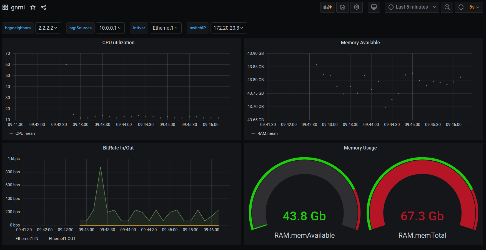

## Requirements
Containerlab 0.19.1
Docker 20.10.10 used
cEOS 4.27.1.1F used as a tag within docker.

## Intro
This is for a talk given on openconfig for CTNUG with using some examples of Openconfig streaming with gNMI

This lab environment is largely based off of [the arista net devops example](https://github.com/arista-netdevops-community/arista_eos_streaming_telemetry_with_gnmi_and_telegraf/blob/master/README.md)

## Start the lab

```
sudo containerlab -t telemetry.yml deploy
```
Give this a few minutes as cEOS needs to boot and then start streaming.

```
+---+-------------------------+--------------+-----------------------+-------+---------+----------------+----------------------+
| # |          Name           | Container ID |         Image         | Kind  |  State  |  IPv4 Address  |     IPv6 Address     |
+---+-------------------------+--------------+-----------------------+-------+---------+----------------+----------------------+
| 1 | clab-telemetry-ceos1    | 32276be808b9 | ceos:4.27.1.1F        | ceos  | running | 172.20.20.2/24 | 2001:172:20:20::2/64 |
| 2 | clab-telemetry-ceos2    | 263a62458de0 | ceos:4.27.1.1F        | ceos  | running | 172.20.20.3/24 | 2001:172:20:20::5/64 |
| 3 | clab-telemetry-grafana  | 7b868612871b | grafana/grafana:7.0.3 | linux | running | 172.20.20.5/24 | 2001:172:20:20::6/64 |
| 4 | clab-telemetry-influxdb | 8f9b71654fa5 | influxdb:1.8.10       | linux | running | 172.20.20.4/24 | 2001:172:20:20::4/64 |
| 5 | clab-telemetry-telegraf | 2107635d54ec | telegraf:latest       | linux | running | 172.20.20.6/24 | 2001:172:20:20::3/64 |
+---+-------------------------+--------------+-----------------------+-------+---------+----------------+----------------------+
```

## Run some of the gnmic commands outputs are within the gnmi-out folder.
#### Capabilities of a device
gnmic -a 172.20.20.2:6030 -u admin -p admin capabilities --insecure

#### Get of all paths
gnmic -a 172.20.20.2:6030 -u admin -p admin get --path "/" --insecure

#### Streaming interface stats
gnmic -a 172.20.20.2:6030 -u admin -p admin subscribe --path "openconfig:/interfaces/interface/state/counters" --insecure

#### AFTs
gnmic -a 172.20.20.2:6030 -u admin -p admin subscribe --path "network-instances/network-instance/afts/" --insecure
- Adding a route
- Deleting a route.

#### eos_native paths
gnmic -a 172.20.20.2:6030 -u admin -p admin --insecure get --path 'eos_native:/Kernel/proc/cpu/utilization/total' --insecure

#### Cli Origin
gnmic -a 172.20.20.2:6030 -u admin -p admin --insecure get --path 'cli:/show version' --insecure

## Grafana

Login to grafana

localhost:3000

admin/admin

Click the + - > import - > Then copy and paste within this repo the grafana/dashboards/gnmi.json within the <b>Import via panel json</b> portion

Click load.

